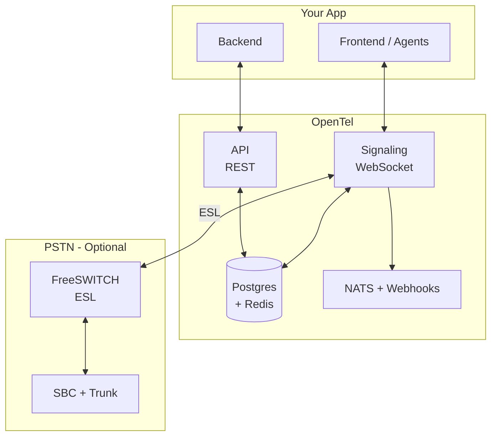
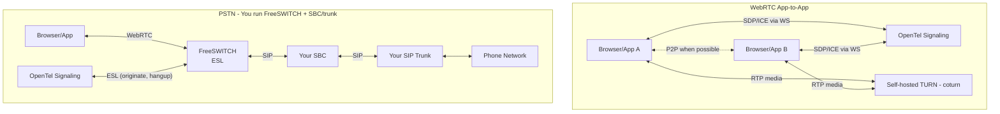
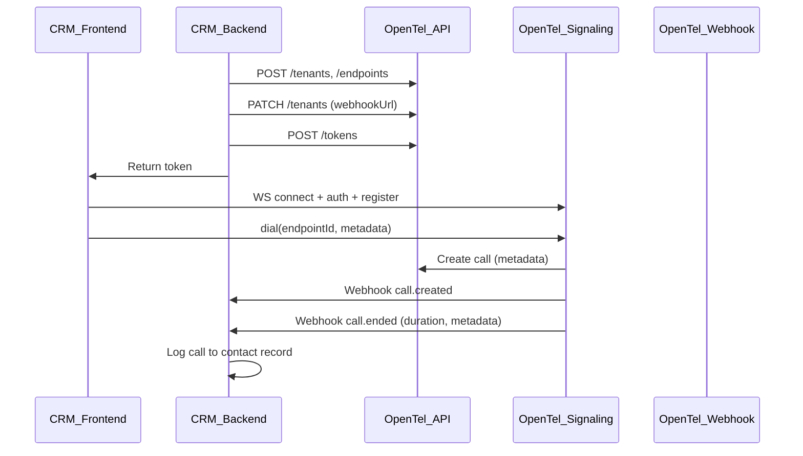
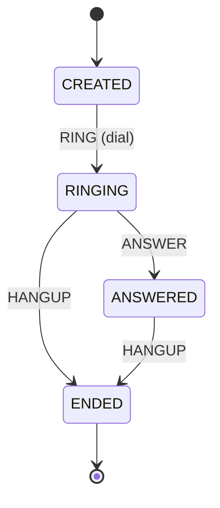

# OpenTel Diagrams

This document contains the main architecture and flow diagrams. See [ARCHITECTURE.md](./ARCHITECTURE.md) for narrative and [PHASE2_PSTN.md](./PHASE2_PSTN.md) for PSTN/FreeSWITCH setup.

---

## 0. System Overview

OpenTel core: API (REST), Signaling (WebSocket), Storage (Postgres + Redis), Events (NATS + webhooks). For real phone numbers you add FreeSWITCH and your SBC/trunk; OpenTel controls the gateway via ESL.



---

## 1. Media Architecture: How Calls Work

**WebRTC-only:** app-to-app calls use OpenTel Signaling for SDP/ICE; media goes P2P or via TURN (e.g. coturn). **PSTN:** real phone calls use a media gateway (FreeSWITCH) and your SBC/trunk. OpenTel controls the gateway via ESL; it does not replace your SBC or carrier.



---

## 2. Embedding Model: CRM / App Integration Flow

Typical flow when an app (e.g. CRM) embeds OpenTel: backend provisions tenant and endpoints, mints tokens; frontend connects to signaling and places calls; webhooks deliver call lifecycle to the backend.



---

## 3. Call State Machine

Call state is stored in Postgres and enforced by the signaling server. Transitions are driven by RING (dial), ANSWER (callee answers), and HANGUP (either party hangs up).



| State    | Allowed transitions |
|----------|----------------------|
| CREATED  | → RINGING (RING)     |
| RINGING  | → ANSWERED (ANSWER), → ENDED (HANGUP) |
| ANSWERED | → ENDED (HANGUP)     |
| ENDED    | (terminal)           |

Implemented in `packages/core` (e.g. `transitionCallState`).

---

## 4. Full Stack: Your App, OpenTel, FreeSWITCH, SBC

How your product (CRM, contact center, support tool), **OpenTel**, **FreeSWITCH**, and your **SBC/trunk** fit together. You run OpenTel and your app; you also run FreeSWITCH and bring your own SBC and SIP trunk for PSTN.

```mermaid
flowchart LR
    subgraph your [Your Product]
        Backend[App Backend]
        Frontend[Agents in browser]
        Backend <-->|token, config| Frontend
    end

    subgraph opentel [OpenTel]
        API[REST API]
        Signaling[Signaling WS]
        Storage[(Postgres + Redis)]
        API <--> Storage
        Signaling <--> Storage
    end

    subgraph gateway [Media Gateway - You Run]
        FreeSWITCH[FreeSWITCH\nESL]
    end

    subgraph carrier [You Provide]
        SBC[SBC]
        Trunk[SIP Trunk]
        PSTN[PSTN]
        SBC <-->|SIP| Trunk
        Trunk <--> PSTN
    end

    Backend -->|REST: tenants, endpoints, tokens| API
    Backend <--|Webhooks| Signaling
    Frontend <-->|WS: dial, answer, SDP/ICE| Signaling
    Frontend <-->|WebRTC| FreeSWITCH
    Signaling <-->|ESL: originate, hangup, inbound-call| FreeSWITCH
    FreeSWITCH <-->|SIP| SBC
```

**Responsibilities**

| Party | Provides |
|-------|----------|
| **Your product** | App backend (provisioning, webhook handler) and frontend (agent UI, client SDK for connect/dial/answer). |
| **OpenTel** | REST API, WebSocket signaling, call state, events, webhooks. Controls FreeSWITCH via ESL; does not run media. |
| **FreeSWITCH** | Media gateway: bridges WebRTC (browser) and SIP. You run it; OpenTel’s gateway-client talks to it over ESL. |
| **SBC + trunk** | Your SBC and SIP trunk (from your carrier). FreeSWITCH registers or sends SIP to your SBC; OpenTel does not talk to the SBC directly. |

**Flows**

- **WebRTC-only:** Frontend ↔ OpenTel Signaling (SDP/ICE); media P2P or via TURN (coturn). No FreeSWITCH or SBC.
- **Outbound PSTN:** User dials a number → Signaling calls gateway-client `originateToPstn()` → FreeSWITCH originates to SBC/trunk → PSTN.
- **Inbound PSTN:** Call hits trunk → SBC → FreeSWITCH; FreeSWITCH (or script) POSTs to OpenTel `POST /inbound-call` → OpenTel creates call and rings endpoint; on answer, FreeSWITCH bridges SIP leg to WebRTC. See [PHASE2_PSTN.md](PHASE2_PSTN.md).
