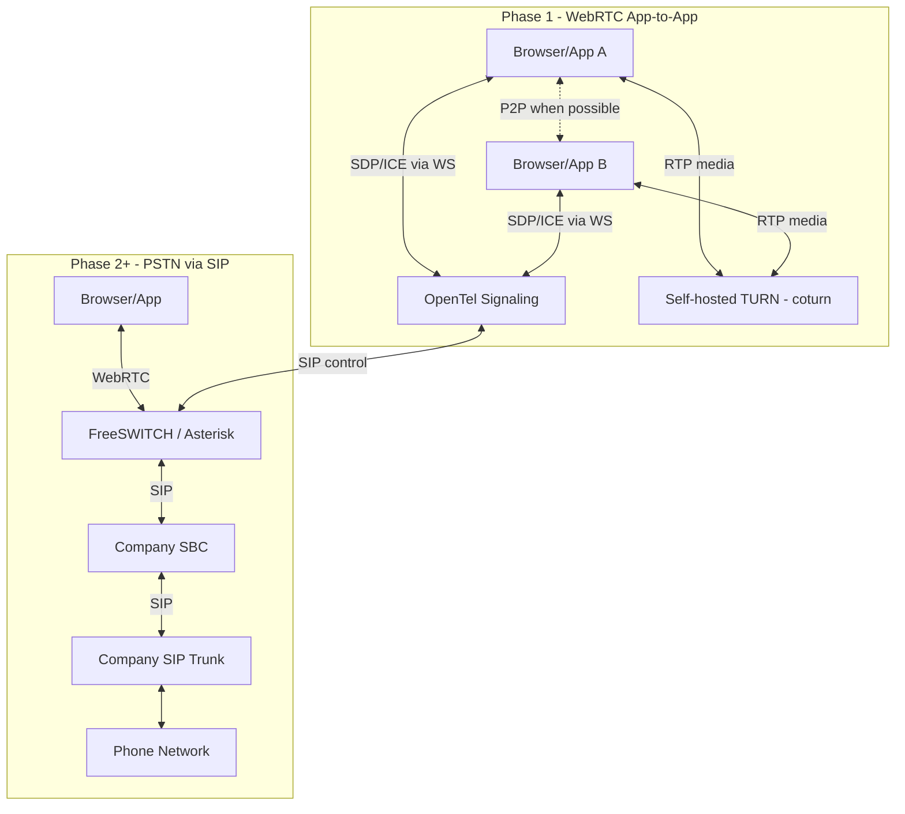
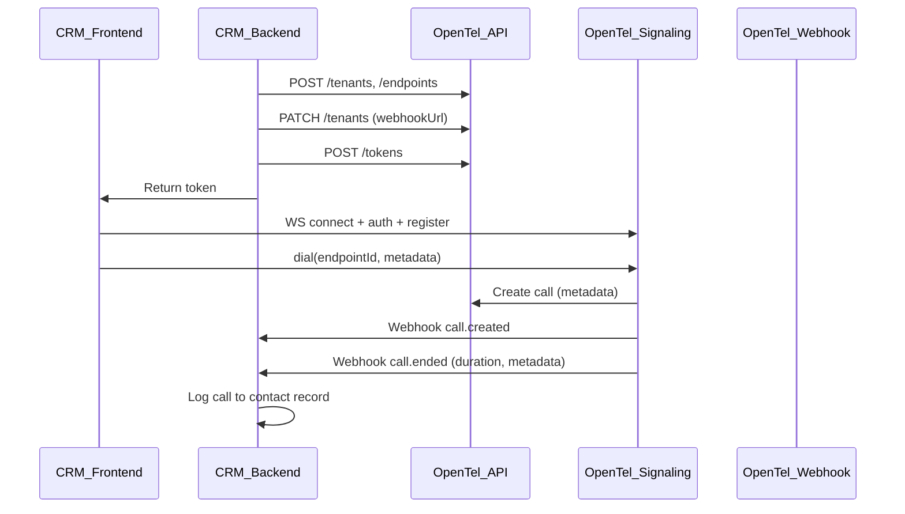
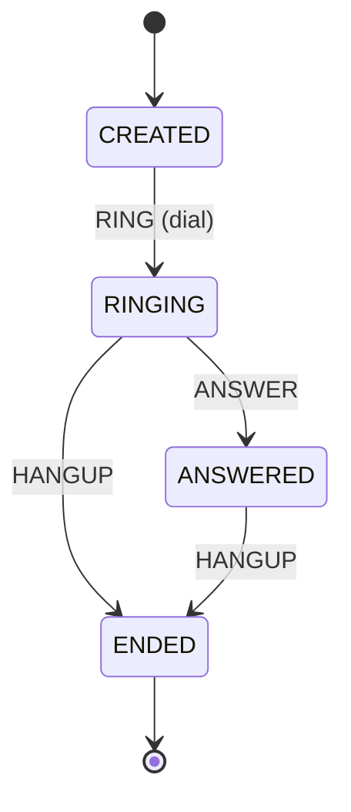

# OpenTel Diagrams

This document contains the main architecture and flow diagrams from the OpenTel plan. See [ARCHITECTURE.md](./ARCHITECTURE.md) for narrative and [MEDIA_ARCHITECTURE.md](./MEDIA_ARCHITECTURE.md) for media details.

---

## 1. Media Architecture: How Calls Work (No Twilio)

Phase 1 is WebRTC app-to-app; Phase 2+ adds PSTN via SIP and a media gateway.



---

## 2. Embedding Model: CRM / App Integration Flow

Typical flow when an app (e.g. CRM) embeds OpenTel: backend provisions tenant and endpoints, mints tokens; frontend connects to signaling and places calls; webhooks deliver call lifecycle to the backend.



---

## 3. Call State Machine

Call state is stored in Postgres and enforced by the signaling server. Transitions are driven by RING (dial), ANSWER (callee answers), and HANGUP (either party hangs up).



| State    | Allowed transitions |
|----------|----------------------|
| CREATED  | → RINGING (RING)     |
| RINGING  | → ANSWERED (ANSWER), → ENDED (HANGUP) |
| ANSWERED | → ENDED (HANGUP)     |
| ENDED    | (terminal)           |

Implemented in `packages/core` (e.g. `transitionCallState`).

---

## 4. SBC, OpenTel, and Customer Product Integration

How a **customer’s product** (CRM, contact center, support tool), **OpenTel**, and the customer’s **SBC** (and carrier) fit together. The customer runs OpenTel and their own app; they bring their SBC and SIP trunk.

```mermaid
flowchart TB
    subgraph customer [Customer's Product]
        Backend[App Backend\nCRM / Contact Center]
        Frontend[App Frontend\nAgents in browser]
        Backend <-->|"token, config"| Frontend
    end

    subgraph opentel [OpenTel]
        API[REST API\ntenants, endpoints, tokens, calls]
        Signaling[Signaling\nWebSocket SDP/ICE]
        Storage[(Storage\nPostgres + Redis)]
        API <--> Storage
        Signaling <--> Storage
    end

    subgraph carrier [Carrier Side - You Provide]
        SBC[SBC\nSession Border Controller]
        Trunk[SIP Trunk]
        PSTN[PSTN / Phone Network]
        SBC <-->|SIP| Trunk
        Trunk <--> PSTN
    end

    subgraph media [Media Gateway - Phase 2]
        Gateway[FreeSWITCH / Asterisk]
    end

    Backend -->|"REST: create tenant, endpoints, mint token"| API
    Backend <--|"Webhooks: call.created, call.ended (from OpenTel)"| Signaling
    Frontend <-->|"WebSocket: auth, register, dial, answer, SDP/ICE"| Signaling
    Frontend <-->|"WebRTC media"| Gateway
    Signaling <-.->|"SIP control (Phase 2)"| Gateway
    Gateway <-->|SIP| SBC
```

**Responsibilities**

| Party | Provides |
|-------|----------|
| **Customer’s product** | App backend (provisioning, webhook handler, business logic) and frontend (agent UI, client-sdk for connect/dial/answer). |
| **OpenTel** | REST API, WebSocket signaling, call state, events, webhooks. No media; in Phase 2 it controls the media gateway. |
| **SBC + trunk** | Your SBC and SIP trunk (from your carrier). OpenTel does not replace them—the gateway talks SIP to your SBC. |

**Flows**

- **App-to-app (Phase 1):** Frontend ↔ OpenTel Signaling (SDP/ICE); media is P2P or via TURN (e.g. coturn). No SBC.
- **App-to-phone (Phase 2):** Frontend ↔ OpenTel Signaling; OpenTel tells the gateway to bridge WebRTC ↔ SIP; gateway ↔ SBC ↔ trunk ↔ PSTN. Same webhooks and call state for the customer’s backend.
