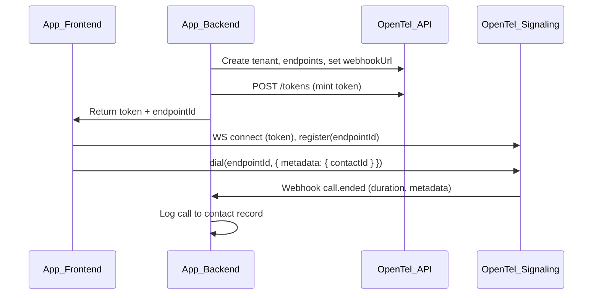

# Embedding OpenTel in Your App

This guide is for developers integrating OpenTel into a **CRM**, **contact center**, **support tool**, or **sales dashboard**. You will provision tenants and endpoints from your backend, mint tokens per user, and use the client SDK in your frontend for calling. Call events are delivered to your app via **webhooks**.

---

## Overview

- **Tenant** = your organization (or one per customer in multi-tenant setups).
- **Endpoint** = one per user who can make or receive calls (agents, reps).
- **Token** = short-lived JWT your backend mints per user session; the frontend uses it to connect to OpenTel signaling.
- **Webhook** = HTTP POST to your backend on call events (e.g. `call.ended` with duration and metadata so you can log the call to a contact).



---

## 1. Provision tenant and endpoints (backend)

Use the **REST API** or **`@opentel/server-sdk`** from your backend (Node.js).

### Option A: Server SDK

```ts
import { OpenTelServerClient } from "@opentel/server-sdk";

const client = new OpenTelServerClient({
  baseUrl: process.env.OPENTEL_API_URL || "http://localhost:3000",
  adminToken: process.env.OPENTEL_ADMIN_TOKEN, // JWT with admin scope
});

// Once per org or per customer
const tenant = await client.createTenant("Acme Corp", "https://your-app.com/webhooks/opentel");

// One per user who can call/be called
const alice = await client.createEndpoint(tenant.id, "Alice");
const bob = await client.createEndpoint(tenant.id, "Bob");

// So OpenTel can POST call events to your app
await client.updateTenantWebhook(tenant.id, "https://your-app.com/webhooks/opentel");
```

### Option B: REST API

- `POST /v1/tenants` — body `{ "name": "Acme", "webhookUrl": "https://..." }`
- `POST /v1/tenants/:tenantId/endpoints` — body `{ "label": "Alice" }`
- `PATCH /v1/tenants/:tenantId` — body `{ "webhookUrl": "https://..." }`

All require `Authorization: Bearer <admin_token>`.

---

## 2. Mint a token per user session (backend)

When a user logs into your app, mint a token scoped to that user’s endpoint so the frontend can connect and register as that endpoint.

```ts
// Server SDK
const token = await client.mintToken(tenant.id, alice.id);
// Return token to frontend (e.g. in login response or a dedicated /api/opentel-token endpoint)
```

REST: `POST /v1/tokens` with body `{ "tenantId": "<tenantId>", "endpointId": "<endpointId>" }` (admin token required).

---

## 3. Frontend: connect, register, and call

In your CRM (or any) frontend, use **`@opentel/client-sdk`**.

1. **Connect** with the token and **register** the current user’s endpoint ID.
2. **On “Call contact”** (or “Call agent”), call `dial(targetEndpointId, { metadata: { contactId: "123" } })`.
3. **Handle events** (incoming call, answer, hangup) via `onEvent`.

### Minimal example

```ts
import { OpenTelClient } from "@opentel/client-sdk";

const client = new OpenTelClient({
  signalingUrl: "wss://your-opentel-signaling.example.com",
  iceServers: [{ urls: "stun:your-turn.example.com:3478" }],
});

client.connect(tokenFromBackend);
client.registerEndpoint(currentUserEndpointId);

client.onEvent((event) => {
  if (event.type === "incoming_call") {
    // Show “Incoming call from …” and answer/hangup buttons
  }
  if (event.type === "call_ended") {
    // Update UI
  }
});

// When user clicks “Call Contact”
function callContact(contactEndpointId: string, contactId: string) {
  client.dial(contactEndpointId, { metadata: { contactId } });
}
```

### WebRTC media (offer/answer/ICE)

The client SDK sends and receives signaling (dial, answer, hangup, offer, answer, ICE). You still need a **WebRTC peer connection** in your app to handle media. Use `sendOffer`, `answer` (with SDP), and `sendIceCandidate` in response to `offer` / `answer` / `ice` events and wire them to your `RTCPeerConnection`. See `infra/dev.html` in this repo for a minimal working example.

---

## 4. Webhooks: receive call events (backend)

Set **webhookUrl** on the tenant (step 1). OpenTel will POST to it on call lifecycle events.

### Request body

Every webhook POST has the same shape:

```json
{
  "event": "call.ended",
  "payload": { ... },
  "ts": "2025-02-11T12:00:00.000Z"
}
```

### Events and payloads

| event           | When              | payload (typical) |
|----------------|-------------------|-------------------|
| `call.created` | Call created      | `callId`, `tenantId`, `fromEndpointId`, `toEndpointId`, `metadata` |
| `call.ringing` | Callee is ringing | `callId` |
| `call.answered`| Call answered     | `callId` |
| `call.ended`   | Call ended        | `callId`, `reason`, `duration` (seconds), `metadata` |

**Example: log call to contact on hangup**

```ts
app.post("/webhooks/opentel", (req, res) => {
  const { event, payload } = req.body;
  if (event === "call.ended" && payload.metadata?.contactId) {
    const { callId, duration, metadata } = payload;
    await yourDb.logCallToContact(metadata.contactId, { callId, duration });
  }
  res.status(200).send("OK");
});
```

Webhooks are fire-and-forget from OpenTel’s side; respond with 2xx quickly. Do not block on heavy work—queue it if needed.

---

## 5. Call history in your UI

Use the REST API (or server SDK) to list calls for a tenant and show them in your app.

```ts
// Server SDK
const calls = await client.listCalls(tenantId, { state: "ENDED", limit: 50 });
```

REST: `GET /v1/tenants/:tenantId/calls?state=ENDED&limit=50`

---

## 6. Local development

- Run OpenTel: `pnpm autoconfigure` then `pnpm dev` (see [README](../README.md)).
- Your app runs on another port (e.g. 3005). Set the tenant’s **webhookUrl** to a URL your backend can receive (e.g. `https://your-ngrok-url.ngrok.io/webhooks/opentel`) so OpenTel can reach it from the internet.
- Use **admin token** for provisioning: `pnpm opentel admin-token` (or your own JWT with admin scope) and set `OPENTEL_ADMIN_TOKEN` in your app’s env.

---

## 7. Summary checklist

1. **Backend:** Create tenant, create endpoints, set webhookUrl, mint token per user session.
2. **Frontend:** Connect with token, register endpoint, call `dial(targetEndpointId, metadata)` for “Call contact”, handle `onEvent` and WebRTC (offer/answer/ICE).
3. **Backend:** Implement webhook handler; on `call.ended`, log duration and metadata to your contact/activity store.
4. **Optional:** Use `GET /v1/tenants/:tenantId/calls` (or server SDK `listCalls`) to show call history in your UI.

For API errors and codes, see [ERROR_CODES.md](ERROR_CODES.md).
