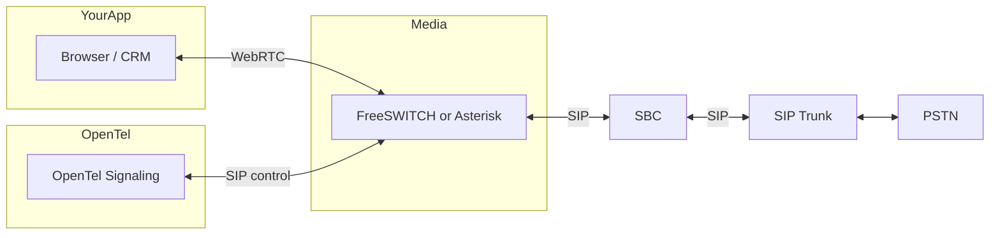

# Phase 2: PSTN / SIP / SBC

Phase 2 adds **outbound and inbound phone (PSTN)** calls by connecting OpenTel to your own **SIP trunk** and **media gateway**. No Twilio or other CPaaS—you bring your own carrier and infrastructure.

---

## Architecture

- **OpenTel** keeps doing signaling and call state (tenants, endpoints, calls, webhooks).
- **Media gateway** (FreeSWITCH or Asterisk) bridges **WebRTC** (browser) and **SIP** (carrier).
- **SBC** (Session Border Controller) sits between the gateway and your **SIP trunk** (provided by your carrier).
- **SIP trunk** connects to the **PSTN** (phone network).

You provide: **SIP trunk** (and usually an SBC). OpenTel Phase 2 adds: **config and control** to talk to a **media gateway** (FreeSWITCH/Asterisk) so that app-to-app and app-to-phone flows use the same OpenTel APIs and webhooks.

---

## What Phase 2 adds

1. **Config**
   - **Gateway URL** – where the media gateway (FreeSWITCH/Asterisk) is reached for control (e.g. ESL or AMI).
   - **SIP trunk / SBC** – host, port, credentials (optional in wizard; many teams configure these on the gateway or SBC directly).

2. **Outbound PSTN**
   - App calls `dial(phoneNumber)` or similar; OpenTel asks the gateway to originate a call to the SIP trunk → PSTN.

3. **Inbound PSTN**
   - Trunk receives a call → SBC → gateway; gateway notifies OpenTel; OpenTel creates a call and notifies the right endpoint (e.g. ring an agent in the CRM).

4. **Same APIs and webhooks**
   - Calls that go over PSTN still appear as calls in OpenTel; same `call.created` / `call.ended` webhooks and call history.

---

## Configuration (Phase 2)

Planned env and wizard options (details may change as we implement):

| Variable / field   | Description |
|--------------------|-------------|
| `OPENTEL_GATEWAY_URL` | Base URL of the media gateway control interface (FreeSWITCH ESL; see **Gateway coverage** below). |
| `OPENTEL_SIP_TRUNK_HOST` | SIP trunk or SBC host (optional if gateway is preconfigured). |
| `OPENTEL_SIP_TRUNK_PORT` | SIP port (e.g. 5060). |
| `OPENTEL_SIP_TRUNK_USER` / `OPENTEL_SIP_TRUNK_PASSWORD` | Trunk auth (if required). |
| `OPENTEL_INBOUND_TENANT_ID` | Tenant ID for inbound PSTN calls (used when gateway POSTs to `/inbound-call`). |
| `OPENTEL_INBOUND_DEFAULT_ENDPOINT_ID` | Endpoint ID to ring for inbound calls (MVP: single endpoint). |

The **config wizard** Step 6 (SIP/SBC) collects these so they can be written to `.env` or your config store. The gateway itself is run and configured by you (Docker, VM, or existing PBX).

### Inbound HTTP callback

When the gateway receives an inbound INVITE, it (or an adapter) should POST to the signaling server:

- **URL:** `POST http://<signaling-host>:<port>/inbound-call`
- **Body:** `{ "callerId": "+15551234567", "dialedNumber": "+15559876543", "channelUuid": "<gateway-channel-uuid>", "routingHint": "optional" }`
- **Response:** `200 OK` with `{ "endpointIds": ["<uuid>"] }` (the endpoint(s) that will be rung).

OpenTel creates a call, sends `incoming_call` to the specified endpoint over WebSocket, and delivers webhooks. When the agent answers, the gateway must bridge the SIP leg to the agent’s WebRTC leg (gateway-specific configuration or API).

**Securing `/inbound-call` (production):** The endpoint is unauthenticated by default so the gateway can call it. To lock it down:

- **Shared secret:** Set `OPENTEL_INBOUND_SECRET`. The gateway must send either the header `X-Inbound-Secret: <secret>` or `Authorization: Bearer <secret>`. Otherwise the server returns `401 Unauthorized`.
- **IP allowlist:** Set `OPENTEL_INBOUND_ALLOWED_IPS` to a comma-separated list of allowed client IPs (e.g. your gateway or SBC). The server uses the request IP (or `X-Forwarded-For` if present). If the client IP is not in the list, the server returns `403 Forbidden`.

You can use one or both. See [SECURITY.md](SECURITY.md) for details.

---

## Gateway coverage

OpenTel’s gateway client is **FreeSWITCH ESL only**. **Asterisk (AMI)** is not implemented. For production PSTN we recommend **FreeSWITCH** with ESL. If you need Asterisk/AMI support, it can be added in a future release.

---

## Recommended path (FreeSWITCH + SBC/trunk)

A minimal known-good setup you can replicate:

1. **FreeSWITCH** – Run FreeSWITCH with mod_event_socket (ESL) enabled. Point OpenTel at `http://<freeswitch-host>:8021` (or your ESL port). Configure FreeSWITCH to register to your SBC or SIP trunk (see your carrier’s docs).
2. **SIP trunk** – Use a single trunk from your carrier (e.g. Twilio Elastic SIP, Telnyx, or a traditional SIP provider). Many carriers provide an SBC or allow direct SIP registration; use the host/port/credentials they give you.
3. **SBC (if required)** – If your trunk or security policy requires an SBC, place it between FreeSWITCH and the trunk. Configure FreeSWITCH to register to the SBC; SBC registers to the trunk.
4. **Inbound** – When a call hits the trunk, it arrives at FreeSWITCH (or SBC → FreeSWITCH). Use a FreeSWITCH dialplan or script to POST to OpenTel Signaling `POST /inbound-call` (see **Inbound HTTP callback** above). After the agent answers, bridge the SIP leg to the agent’s WebRTC leg (see **Bridge-on-answer** below).

This path is tested with FreeSWITCH; other gateways would require an adapter or additional implementation.

---

## Bridge-on-answer (inbound)

Inbound flow: OpenTel creates the call and rings the endpoint; when the agent answers in the browser, the **gateway** must connect (bridge) the incoming SIP leg to the agent’s WebRTC leg. That step is gateway-specific:

- **FreeSWITCH**: Use a dialplan or Lua/script that, when the endpoint “answers” (e.g. via an API or ESL command from OpenTel or your app), bridges the existing SIP channel to a WebRTC leg (or vice versa). A common pattern is: inbound INVITE creates a channel; you notify OpenTel; OpenTel rings the agent; when the agent answers, your app or OpenTel’s gateway-client tells FreeSWITCH to bridge the SIP channel to the agent’s WebRTC session. Exact dialplan/script depends on your FreeSWITCH version and how you initiate the WebRTC leg. We recommend documenting or scripting this once for your setup and reusing it.
- **Future**: An optional “bridge on answer” API in the gateway-client could standardize this; for now, use the gateway’s native mechanism.

---

## Implementation roadmap

| Step | Description |
|------|-------------|
| **2.1** | Config schema and wizard Step 6 – gateway URL, optional SIP trunk fields; save to env/config. |
| **2.2** | **Gateway client** – small service or library that talks to FreeSWITCH (ESL) or Asterisk (AMI) to originate and receive calls. |
| **2.3** | **Signaling extension** – when a “dial” target is a phone number (E.164), route the call via the gateway to the SIP trunk instead of WebRTC-only. |
| **2.4** | **Inbound** – gateway receives INVITE from trunk; notifies OpenTel; OpenTel creates call and signals the chosen endpoint (e.g. ring agent). |

Phase 2 work starts with **2.1** (config + wizard) and **docs** (this file + [MEDIA_ARCHITECTURE.md](MEDIA_ARCHITECTURE.md)); then **2.2** (gateway client) and **2.3** / **2.4** (signaling and inbound).

---

## What you need to run PSTN

- A **SIP trunk** (from a carrier or SIP provider).
- An **SBC** (software or appliance) if your trunk or security policy requires it.
- **FreeSWITCH** (recommended) installed and configured to:
  - Register to your SBC/trunk.
  - Expose **ESL** (Event Socket Layer) for control. OpenTel’s gateway client uses ESL only; Asterisk/AMI is not supported today.

OpenTel does **not** replace the gateway or SBC; it configures and controls the gateway so that CRM/app flows (and webhooks) stay unified for both WebRTC and PSTN.
