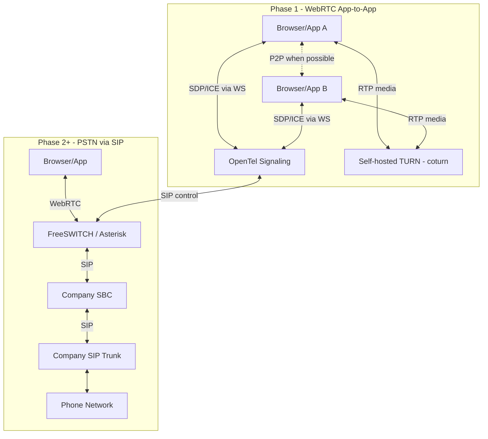
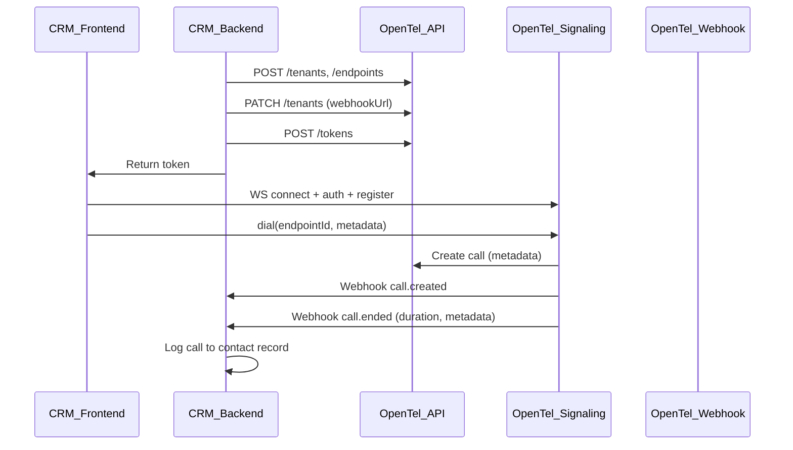

# OpenTel Backbone Phone System - Implementation Plan

## Product Positioning

**OpenTel** is an open-source alternative to commercial call/contact center platforms (NICE, Genesys Cloud). Companies can self-host it instead of paying for enterprise suites.

- **Self-hostable**: No SaaS lock-in. Deploy on your own infrastructure.
- **API-first**: Apps (internal CRM, contact center, support tool) use REST APIs for calls, voice recording, call flows, etc. No UI required for day-to-day use.
- **Config wizard (exception)**: One UI—a step-by-step configuration tool for the team. Guided setup for database, Redis, NATS, JWT, TURN/STUN, and SIP/SBC (Phase 2). Teams run through the wizard to set up OpenTel without editing config files.
- **No third-party call dependencies**: No Twilio, Vonage, or other commercial CPaaS. Media paths use open-source components and company-provided trunks.

---

## Media Architecture: How Calls Work (No Twilio)




**Phase 1 (MVP)**: WebRTC app-to-app

- **Signaling**: OpenTel WebSocket server exchanges SDP/ICE between endpoints
- **Media**: WebRTC P2P when NAT allows; otherwise through self-hosted **coturn** (TURN/STUN server)
- **Zero third parties**: No Twilio. Add coturn to docker-compose; companies self-host it

**Phase 2+ (Future)**: PSTN/SIP

- Company provides: **SBC** (Session Border Controller) + **SIP trunk** (from carrier)
- OpenTel integrates with open-source **FreeSWITCH** or **Asterisk** as media gateway
- OpenTel sends SIP control to gateway; gateway bridges WebRTC ↔ SIP ↔ PSTN
- Still no Twilio: company brings their own trunk

---

## Embedding Model

When a company uses OpenTel (contact center, CRM, support tool, etc.):

- **Tenant** = the organization using the system (company, department, or sub-tenant for multi-tenant deployments)
- **Endpoints** = phone-capable users (agents, reps) in that tenant
- **Integration flow**:
  1. CRM backend provisions tenant + endpoints via REST API (or at onboarding)
  2. CRM backend mints tokens for authenticated users
  3. CRM frontend loads client-sdk, connects with token, registers endpoint
  4. User clicks "Call Contact" → CRM calls `dial(targetEndpointId, { metadata: { contactId } })`
  5. Call events flow to CRM via **webhooks** (backend) and **WS** (frontend)
  6. CRM backend receives `call.ended` webhook → logs call to contact record, updates activity




---

## Monorepo Structure Overview

```
opentel/                  # Monorepo lives at workspace root
├── apps/
│   ├── api/              # Fastify REST API
│   ├── signaling/        # Fastify + WebSocket signaling
│   ├── config-wizard/    # Configuration wizard UI (database, Redis, NATS, TURN, SIP/SBC)
│   └── demo-cli/         # Commander CLI
├── packages/
│   ├── core/             # Domain models + call state machine
│   ├── errors/           # Error codes, OpenTelError, toHttpStatus
│   ├── schemas/          # Zod schemas
│   ├── events/           # NATS pub/sub
│   ├── auth/             # JWT mint/verify
│   ├── storage/          # Kysely + Redis
│   ├── client-sdk/       # Browser SDK (for embedding in frontend)
│   └── server-sdk/       # Node.js SDK (for embedding in backend)
├── infra/
│   └── docker-compose.yml
└── docs/
    ├── EVENT_CATALOG.md
    ├── ARCHITECTURE.md
    ├── MEDIA_ARCHITECTURE.md
    ├── ERROR_CODES.md
    ├── GRAFANA_SETUP.md
    └── EMBEDDING_GUIDE.md
```

---

## Pre-Build Conventions

- **Monorepo root**: Workspace root (e.g. `/openTel`) is the monorepo root. No nested `opentel/opentel/`.
- **Node**: 20 LTS. Enforce via `engines` in package.json.
- **Idempotency**: Create operations (tenants, endpoints) are idempotent where reasonable. E.g. `createTenant(name)` with existing name returns existing tenant or "name taken" per product choice.

---

## Technical Decisions (Recommendations)

| Decision | Recommendation | Rationale |
|----------|----------------|-----------|
| **Config wizard Phase 1** | Implement steps 1–5 (database, Redis, NATS, JWT, TURN/STUN). SIP/SBC as placeholder ("Phase 2"). | Wizard is useful for initial deployment; no SIP until Phase 2. |
| **Offline callee** | Create call and ring. No presence check. | Simpler MVP. Caller can hang up if no answer. Optional ring timeout in Phase 2. |
| **WebRTC signaling** | Caller sends `offer` first; callee sends `answer` after user accepts. `dial` -> `incoming_call` to callee -> caller sends `offer` -> callee sends `answer` -> ICE. | Correct WebRTC order; document clearly. |
| **Config wizard hosting** | Build and serve from API at `/config`. Single deployment. | Simplest ops; no separate server. API serves static build in production. |
| **coturn image** | Use `instrumentisto/coturn` (or verify `coturn/coturn` exists). | Well-maintained; common in production. |

---

## Phase 1: Scaffolding & Configuration

### 1.1 Root Configuration

- **pnpm-workspace.yaml**: Declare packages `apps/*` and `packages/*`
- **package.json**: Root scripts (`i`, `dev`, `db:migrate`, `build`, `test`, `lint`), `engines: { "node": ">=20" }`, devDependencies (typescript, vitest, eslint, prettier)
- **turbo.json**: Pipeline for `build`, `dev`, `test`, `lint` with appropriate dependencies
- **tsconfig.base.json**: Shared TS config (strict, ES2022, composite)
- **.eslintrc.cjs** + **.prettierrc**: Lint/format config
- **.env.example**: `DATABASE_URL`, `REDIS_URL`, `NATS_URL`, `JWT_SECRET`, `API_PORT`, `SIGNALING_PORT`, `STUN_URL`, `TURN_URL` (optional; for client-sdk ICE config—defaults to coturn when using docker-compose)

### 1.2 Package Dependencies (Summary)


| Package    | Key deps                                  |
| ---------- | ----------------------------------------- |
| schemas    | zod                                       |
| errors     | (none)                                    |
| core       | schemas                                   |
| auth       | schemas, jsonwebtoken                     |
| events     | schemas, nats                             |
| storage    | schemas, core, kysely, pg, ioredis        |
| client-sdk | schemas (browser bundle)                  |
| server-sdk | schemas, fetch/axios                      |
| api           | fastify, fastify-openapi, all packages    |
| signaling     | fastify, @fastify/websocket, all packages |
| config-wizard | next, @fluentui/react-components         |
| demo-cli      | commander, axios, all packages           |


---

## Phase 2: Packages (Bottom-Up)

### 2.1 `packages/schemas`

- **Zod schemas** for:
  - Tenant: `{ id, name, webhookUrl?, createdAt }`
  - Endpoint: `{ id, tenantId, label, type, createdAt }`
  - Call: `{ id, tenantId, fromEndpointId, toEndpointId, state, metadata?, createdAt, updatedAt }` (metadata: optional `Record<string, string>` for CRM context: contactId, leadId, etc.)
  - API DTOs: `CreateTenantInput`, `CreateEndpointInput`, `MintTokenInput`, `UpdateTenantInput` (webhookUrl)
  - WS messages: `AuthMessage`, `RegisterMessage`, `DialMessage` (includes optional `metadata`), `AnswerMessage`, `HangupMessage`, `OfferMessage`, `AnswerMessage`, `IceMessage`
  - Events: All events include `metadata` when present; `CallEndedEvent` includes `duration` (seconds)
  - Webhook payload: `{ event: string, payload: object, ts: string }`
- Export all schemas and inferred types

### 2.2 `packages/core`

- **Call state machine** (pure, no side effects):
  - States: `CREATED | RINGING | ANSWERED | ENDED`
  - Transitions: `CREATED -> RINGING`, `RINGING -> ANSWERED`, `RINGING -> ENDED`, `ANSWERED -> ENDED`
  - Function: `transitionCallState(currentState, event) -> nextState | null`
  - Unit tests for all valid/invalid transitions
- **Domain types** re-exported from schemas

### 2.3 `packages/auth`

- `mintToken(secret, payload: { tenantId, endpointId?, scopes[] }): string`
- `verifyToken(secret, token): { tenantId, endpointId?, scopes }`
- Use `jsonwebtoken`; expiry 24h for tokens

### 2.4 `packages/events`

- NATS client wrapper: `connect(url)`, `publish(subject, payload)`, `subscribe(subject, handler)`, `close()`
- Subject: `opentel.calls` for all call events
- Helpers: `publishCallEvent(event)` serializes event and publishes to NATS
- **Webhook delivery**: `deliverWebhook(webhookUrl, event)` — POST JSON to tenant webhook URL (fire-and-forget, non-blocking). On failure, log; no retries in MVP.
- Types from schemas

### 2.5 `packages/storage`

- **Kysely** setup:
  - `infra/db.ts`: Kysely instance with pg driver
  - Migrations folder: `migrations/`
  - Migration 001: `tenants` (id, name, webhook_url, created_at), `endpoints`, `calls` (id, tenant_id, from_endpoint_id, to_endpoint_id, state, metadata JSONB, created_at, updated_at, answered_at for duration)
- **Repositories**:
  - `createTenant(name, webhookUrl?)` — idempotent: if tenant with name exists, return it (or error per product choice)
  - `updateTenantWebhook(tenantId, webhookUrl)`, `getTenant(tenantId)`
  - `createEndpoint(tenantId, label, type)` — idempotent: if endpoint with tenantId+label exists, return it
  - `listEndpoints(tenantId)`
  - `createCall(tenantId, from, to, metadata?)`, `updateCallState(callId, state)`, `getCall(callId)`, `listCalls(tenantId, filters?, pagination?)`
- **Redis**:
  - `setPresence(endpointId, online)`, `getPresence(endpointId)` for WS connect/disconnect

### 2.6 `packages/client-sdk`

- Browser-compatible (ESM or UMD) build via tsup or esbuild
- **Class or factory**: `OpenTelClient`
  - `connect(authToken: string)`
  - `registerEndpoint(endpointId: string)`
  - `dial(targetEndpointId: string, metadata?: Record<string, string>)` — e.g. `{ contactId: "123" }` for CRM
  - `answer(callId: string)`
  - `hangup(callId: string)`
  - `sendIceCandidate(callId, candidate)`
  - `onEvent(cb: (event) => void)`
- WebRTC helper skeleton: `createPeerConnection(iceServers?)` — supports configurable ICE servers (STUN/TURN). Default: use `stun:localhost:3478` and optional `turn:localhost:3478` when coturn is self-hosted. Document that companies provide their own TURN URL (or use coturn from docker-compose).
- README with example usage snippet and embedding notes

### 2.7 `packages/server-sdk`

- Node.js package for app backends (CRM, contact center, etc.) to integrate without raw HTTP
- **OpenTelServerClient** (or `createOpenTelClient`):
  - `createTenant(name, webhookUrl?)`
  - `updateTenantWebhook(tenantId, webhookUrl)`
  - `createEndpoint(tenantId, label)`
  - `listEndpoints(tenantId)`
  - `mintToken(tenantId, endpointId?, scopes?)`
  - `listCalls(tenantId, filters?)`
  - `getCall(callId)`
- Uses `fetch` or `axios` under the hood; requires `baseUrl` and `adminToken` (or tenant token)
- README with app integration example

---

## Phase 3: Apps

### 3.1 `apps/api`

- **Fastify** app with:
  - `@fastify/cors`
  - `@fastify/swagger` + `@fastify/swagger-ui` for `/docs`
  - Request ID middleware (pino + `requestId`)
  - Error handler returning `{ errorCode, message, requestId }`
- **Routes** (all require JWT except `/health`):
  - `POST /v1/tenants` body `{ name, webhookUrl? }` -> create tenant
  - `PATCH /v1/tenants/:tenantId` body `{ webhookUrl }` -> update tenant webhook (for CRM to receive events)
  - `GET /v1/tenants/:tenantId/endpoints` -> list endpoints (paginated)
  - `POST /v1/tenants/:tenantId/endpoints` body `{ label }` -> create endpoint
  - `POST /v1/tokens` body `{ tenantId, endpointId?, scopes[] }` -> mint JWT (admin only for bootstrap)
  - `GET /v1/tenants/:tenantId/calls` query `?state=&limit=&offset=` -> list calls for CRM history
  - `GET /v1/calls/:callId` -> get call details (tenant-scoped)
  - `GET /health` -> `{ status: "ok" }`
  - **Config wizard** (bootstrap/setup mode): `POST /v1/config/test-database`, `POST /v1/config/test-redis`, `POST /v1/config/test-nats`, `POST /v1/config/save` — validate and persist config; no normal JWT, use bootstrap token.
- Zod validation via `@fastify/type-provider-zod` or manual validation
- Use `storage` for DB, `auth` for JWT (admin token bypass for bootstrap)

### 3.2 `apps/signaling`

- **Fastify** + `@fastify/websocket`
- **WebSocket handler** at `GET /ws`:
  1. Accept connection, wait for `{ type: "auth", token }` -> verify JWT, extract tenantId
  2. Wait for `{ type: "register", endpointId }` -> associate socket with endpointId, set Redis presence
  3. Handle incoming messages:
    - `dial`: create call (Postgres) with optional `metadata`, transition to RINGING, publish `call.created` + `call.ringing`, send to both endpoints, **deliver webhook** if tenant has webhookUrl
    - `answer`: transition to ANSWERED, set `answeredAt`, relay SDP, publish `call.answered`, deliver webhook
    - `hangup`: transition to ENDED, compute duration from answeredAt, publish `call.ended` with reason + duration, **deliver webhook** (CRM uses this to log call to contact)
    - `offer`/`answer`/`ice`: relay to other endpoint, publish `signaling.*` events
  4. On disconnect: clear Redis presence
- **Socket registry**: Map `endpointId -> WebSocket` for routing
- **Webhook delivery**: On each event (call.created, call.ringing, call.answered, call.ended), fetch tenant webhookUrl from storage; if present, POST `{ event, payload, ts }` to that URL (async, non-blocking)
- Tenant isolation: verify `endpointId` belongs to `tenantId` before any action

### 3.3 `apps/config-wizard`

- **Purpose**: Step-by-step configuration tool for the team. The only UI in the project.
- **Tech**: **Next.js** with **Fluent UI** (Microsoft Fluent UI React). Modern, accessible UI. Build output served by API at `/config` or run as standalone app on port 3003.
- **Wizard steps** (team goes through each in order):
  1. **Database**: Postgres URL, credentials. Test connection before proceeding.
  2. **Redis**: Redis URL. Test connection.
  3. **NATS**: NATS URL. Test connection.
  4. **Security**: JWT secret (generate or paste). Optional: first admin user.
  5. **TURN/STUN**: coturn host, port, credentials (if TURN auth). Test reachability.
  6. **SIP/SBC** (Phase 2): SIP trunk provider, host, port, credentials; SBC settings; media gateway (FreeSWITCH/Asterisk) URL. Placeholder in Phase 1.
- **Output**: Wizard writes to `.env` or config file. Each step validates before allowing "Next". Final step runs migrations and marks setup complete.
- **Auth**: Admin token or bootstrap mode (first-run redirect).
- **Hosting**: Next.js app runs on port 3003 (`pnpm dev:wizard`), or build static export and serve from API at `/config`.
- **API routes**: `POST /v1/config/test-database`, `POST /v1/config/test-redis`, etc. for validation. `POST /v1/config/save` persists (writes .env or config store). Config routes skip normal JWT; use bootstrap token or "setup mode" check.

### 3.4 `apps/demo-cli`

- **Commander** CLI:
  - `opentel create-tenant <name> [--webhook-url <url>]`
  - `opentel set-webhook <tenantId> <webhookUrl>`
  - `opentel create-endpoint <tenantId> <label>`
  - `opentel mint-token <tenantId> [endpointId]`
  - `opentel admin-token` (mint admin JWT for bootstrap)
  - `opentel quickstart` (or similar) -> prints steps for first call
- Uses `axios` to call local API
- Reads `API_URL` from env (default `http://localhost:3000`)

---

## Phase 4: Infrastructure & Dev Experience

### 4.1 `infra/docker-compose.yml`

- **postgres**: image `postgres:16`, port 5432, env `POSTGRES_USER`, `POSTGRES_PASSWORD`, `POSTGRES_DB`
- **redis**: image `redis:7`, port 6379
- **nats**: image `nats:latest`, port 4222
- **coturn**: image `instrumentisto/coturn`, ports 3478 (UDP/TCP). STUN/TURN for WebRTC. Self-hosted—no Twilio TURN.
- **prometheus**: image `prom/prometheus`, port 9090. Scrapes API and Signaling `/metrics`.
- **grafana**: image `grafana/grafana`, port 3002. Admin dashboard; Prometheus datasource pre-provisioned.

### 4.2 Root Scripts

- `pnpm dev`: `turbo run dev --parallel` (api + signaling)
- `pnpm db:migrate`: run Kysely migrations (from storage or a dedicated script)
- `pnpm build`: `turbo run build`
- `pnpm test`: `turbo run test`

### 4.3 Dev HTML / Example

- `infra/dev.html` or `examples/first-call.html`: Minimal HTML that loads client-sdk, connects with token, registers endpoint, has buttons for dial/answer/hangup
- Or `examples/first-call.mjs`: Node script that uses client-sdk (if SDK supports Node WS)

---

## Phase 5: Docs

### 5.1 `README.md`

- **Project overview**: Open-source alternative to NICE/GenesysCloud; self-hostable; no Twilio or third-party call dependencies
- Architecture diagram (mermaid)
- Local setup: `docker-compose up` (postgres, redis, nats, coturn), `pnpm i`, `pnpm db:migrate`, `pnpm dev`
- "First Call" walkthrough: create tenant, endpoints, mint tokens, open two tabs, place call
- Package descriptions

### 5.2 `docs/ARCHITECTURE.md`

- System components
- Data flow: API -> Storage; Signaling -> NATS, Storage, WebSocket
- Call state machine diagram
- Multi-tenancy model

### 5.3 `docs/MEDIA_ARCHITECTURE.md`

- **Zero third-party call dependencies**: No Twilio, Vonage, or commercial CPaaS
- **Phase 1**: WebRTC app-to-app. Signaling via OpenTel WS; media via P2P or self-hosted coturn (TURN/STUN)
- **Phase 2+ roadmap**: PSTN via company-provided SBC + SIP trunk + FreeSWITCH/Asterisk integration
- **coturn**: Include in docker-compose; document ICE server config for client-sdk

### 5.4 `docs/EVENT_CATALOG.md`

- Listed events: `call.created`, `call.ringing`, `call.answered`, `call.ended`, `signaling.offer`, `signaling.answer`, `signaling.ice`
- Payload schemas for each
- NATS subject `opentel.calls`
- WebSocket event format

### 5.5 `docs/ERROR_CODES.md`

- Complete catalog of all error codes with HTTP status mapping
- When to use each code (with examples)
- Full error response schema
- Validation error `fields` structure
- Example responses for each code

### 5.6 `docs/GRAFANA_SETUP.md`

- How to access Grafana (localhost:3002)
- Default credentials (admin/admin)
- Pre-provisioned Prometheus datasource
- Suggested dashboards: call volume, error rates, latency, active connections

### 5.7 `docs/EMBEDDING_GUIDE.md`

- **Target audience**: App developers embedding OpenTel (CRM, contact center, support tool, sales dashboard)
- **Integration flow**:
  1. Provision tenant (once per app or per customer)
  2. Create endpoints for each phone-capable user
  3. Configure webhook URL so CRM backend receives call events
  4. Per user session: mint token, pass to frontend
  5. Frontend: load client-sdk, connect, register endpoint, use dial/answer/hangup
  6. When user clicks "Call Contact": `dial(targetEndpointId, { metadata: { contactId: "xyz" } })`
  7. On `call.ended` webhook: CRM logs call duration + metadata to contact record
- **Code examples**: server-sdk usage, client-sdk in React/Vue, webhook handler sample
- **Call history**: Use `GET /v1/tenants/:tenantId/calls` to display in CRM UI
- **Local dev**: Use ngrok or similar to expose CRM webhook URL for testing

---

## Error Handling System

### Error Format (API & Signaling)

All API errors return a rich, consistent JSON shape:

```json
{
  "error": {
    "code": "TENANT_NOT_FOUND",
    "message": "Tenant with id 'abc-123' does not exist",
    "requestId": "req-uuid",
    "timestamp": "2025-02-11T12:00:00.000Z",
    "path": "/v1/tenants/abc-123/endpoints",
    "method": "GET",
    "details": {
      "tenantId": "abc-123"
    },
    "docs": "https://docs.opentel.io/errors#TENANT_NOT_FOUND"
  }
}
```

**Validation errors** include field-level detail:

```json
{
  "error": {
    "code": "VALIDATION_ERROR",
    "message": "Request validation failed",
    "requestId": "req-uuid",
    "timestamp": "2025-02-11T12:00:00.000Z",
    "path": "/v1/tenants",
    "method": "POST",
    "details": {
      "fields": [
        { "path": ["name"], "message": "Required" },
        { "path": ["webhookUrl"], "message": "Invalid URL" }
      ]
    }
  }
}
```

### Error Codes Catalog (Comprehensive)

| Code | HTTP | Description |
|------|------|-------------|
| **Auth** | | |
| `TOKEN_MISSING` | 401 | No Authorization header present |
| `TOKEN_INVALID` | 401 | Malformed or expired JWT |
| `TOKEN_EXPIRED` | 401 | JWT has expired |
| `INSUFFICIENT_SCOPE` | 403 | Token valid but missing required scope (e.g. admin) |
| `TENANT_MISMATCH` | 403 | Token tenantId does not match resource tenant |
| **Resources** | | |
| `TENANT_NOT_FOUND` | 404 | Tenant id does not exist |
| `ENDPOINT_NOT_FOUND` | 404 | Endpoint id does not exist |
| `CALL_NOT_FOUND` | 404 | Call id does not exist |
| **Validation** | | |
| `VALIDATION_ERROR` | 400 | Request body/query failed schema validation |
| `INVALID_UUID` | 400 | Path param (tenantId, endpointId, callId) is not a valid UUID |
| `NAME_REQUIRED` | 400 | Tenant/endpoint name missing or empty |
| `LABEL_REQUIRED` | 400 | Endpoint label missing or empty |
| **Conflict** | | |
| `TENANT_NAME_EXISTS` | 409 | Tenant with that name already exists |
| `ENDPOINT_LABEL_EXISTS` | 409 | Endpoint with that label already exists for tenant |
| **Rate / Limits** | | |
| `RATE_LIMIT_EXCEEDED` | 429 | Too many requests |
| **Server** | | |
| `INTERNAL_ERROR` | 500 | Unhandled exception |
| `DATABASE_ERROR` | 503 | Postgres/Redis connection or query failed |
| `NATS_ERROR` | 503 | NATS publish/subscribe failed |

### Implementation

- **packages/errors**: Shared package with `OpenTelError` class, full error codes enum, `toHttpStatus()`, and `toApiResponse()` that builds the full JSON shape
- **details**: Always include relevant context (e.g. `tenantId`, `endpointId` for NOT_FOUND; `fields` array for VALIDATION_ERROR)
- **docs**: Optional `docs` URL in response pointing to error reference (configurable base URL)
- **API**: Fastify `setErrorHandler` that catches `OpenTelError`; attaches `requestId`, `path`, `method`, `timestamp`; serializes `details`
- **Signaling**: WS errors use `{ type: "error", errorCode, message, requestId }` (compact for realtime)
- **Logging**: Log all errors with full context; stack trace for 5xx

### Usage in Routes

```ts
throw new OpenTelError("TENANT_NOT_FOUND", "Tenant with id 'abc' does not exist", { tenantId: "abc" });
throw new OpenTelError("VALIDATION_ERROR", "Request validation failed", { fields: zodIssues });
throw new OpenTelError("INSUFFICIENT_SCOPE", "Admin scope required for this operation", { required: ["admin"] });
```

---

## Grafana Admin Dashboard

### Stack

- **Prometheus**: Scrapes metrics from API and Signaling (HTTP `/metrics` endpoints)
- **Grafana**: Admin dashboard; datasource = Prometheus
- **Metrics**: Use `prom-client` in API and Signaling to expose request counts, latency, call counts, WebSocket connections, etc.

### Docker Compose

Add to `infra/docker-compose.yml`:

- **prometheus**: Scrape config for `api:3000/metrics`, `signaling:3001/metrics` (or localhost when running on host)
- **grafana**: Port 3002; default admin/admin; preconfigure Prometheus datasource via provisioning

### Metrics to Expose

- `http_requests_total`, `http_request_duration_seconds` (API)
- `ws_connections_total`, `calls_created_total`, `calls_ended_total` (Signaling)
- Optional: DB connection pool, Redis ops, NATS publish count

### Access

- Grafana at `http://localhost:3002` (or deploy URL)
- Admin-focused: call volume, error rates, latency percentiles, active connections

---

## Phase 6: Quality & Observability

- **Logging**: pino with `requestId` in Fastify; attach `requestId` to WS context
- **Error format**: Use `packages/errors` and centralized handler
- **Tests**:
  - `packages/core`: Call state machine transitions (Vitest)
  - `apps/api`: At least one route (e.g. `POST /v1/tenants`) with Supertest
- **OpenTelemetry**: Optional skeleton (trace provider) if time permits; pino is required

---

## Implementation Order

1. Scaffolding (pnpm, turbo, tsconfig, eslint, prettier)
2. `packages/schemas` (all Zod schemas, including metadata + webhook payloads)
3. `packages/errors` (OpenTelError, error codes, toHttpStatus)
4. `packages/core` (state machine + tests)
5. `packages/auth`
6. `packages/events` (NATS + webhook delivery helper)
7. `packages/storage` (migrations + repos + Redis, incl. webhookUrl, metadata, listCalls)
8. `infra/docker-compose.yml` (incl. Prometheus, Grafana)
9. `apps/api` (setErrorHandler, `/metrics`, prom-client)
10. `apps/signaling` (metadata in dial, webhook delivery, `/metrics`)
11. `apps/demo-cli`
12. `apps/config-wizard` (steps 1–5: database, Redis, NATS, JWT, TURN/STUN; step 6 placeholder)
13. `packages/client-sdk` (dial with metadata)
14. `packages/server-sdk`
15. Dev HTML / example (show dial with metadata)
16. Docs (README, ARCHITECTURE, MEDIA_ARCHITECTURE, EVENT_CATALOG, EMBEDDING_GUIDE, ERROR_CODES, GRAFANA_SETUP)

---

## Key Files to Create


| Path                                             | Purpose                                     |
| ------------------------------------------------ | ------------------------------------------- |
| `pnpm-workspace.yaml`                            | Workspace definition                        |
| `turbo.json`                                     | Build pipeline                              |
| `packages/schemas/src/index.ts`                  | All Zod schemas                             |
| `packages/errors/src/index.ts`                  | OpenTelError, error codes, toHttpStatus     |
| `packages/core/src/state-machine.ts`             | Call state transitions                      |
| `packages/storage/src/migrations/001_initial.ts` | DB schema                                   |
| `packages/events/src/webhook.ts`                 | Webhook delivery helper                     |
| `apps/api/src/app.ts`                            | Fastify app + routes                        |
| `apps/signaling/src/app.ts`                      | Fastify + WS handler                        |
| `apps/config-wizard/`                            | Step-by-step config wizard (DB, Redis, NATS, JWT, TURN, SIP placeholder) |
| `packages/client-sdk/src/client.ts`              | OpenTelClient class                         |
| `packages/server-sdk/src/client.ts`              | OpenTelServerClient for backends            |
| `infra/docker-compose.yml`                       | Postgres, Redis, NATS, Prometheus, Grafana  |
| `infra/dev.html`                                 | Minimal browser test page                   |
| `docs/MEDIA_ARCHITECTURE.md`                     | Media path, no-Twilio, coturn, PSTN roadmap |
| `docs/EMBEDDING_GUIDE.md`                        | App embedding walkthrough                   |


---

## Admin Token Flow

For local bootstrap, the CLI can mint an "admin" token with a special scope (e.g. `admin`) that allows calling `POST /v1/tokens` without an existing tenant-scoped token. The API will accept either:

- A valid tenant-scoped token for tenant operations, or
- An admin token (minted with `JWT_SECRET` + `scope: ["admin"]`) for bootstrapping tenants/endpoints/tokens

